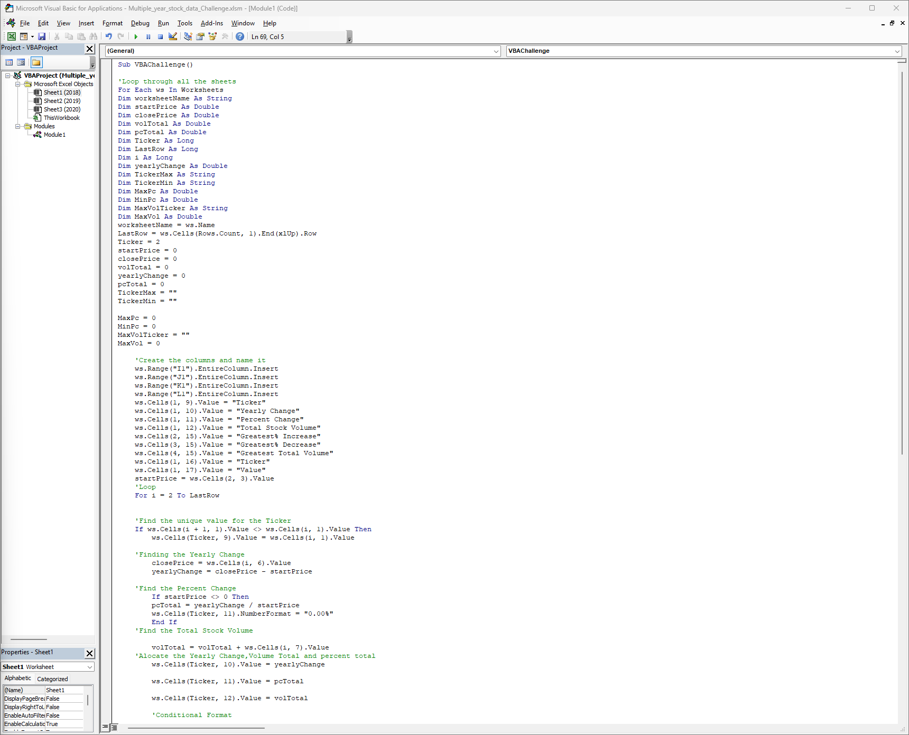
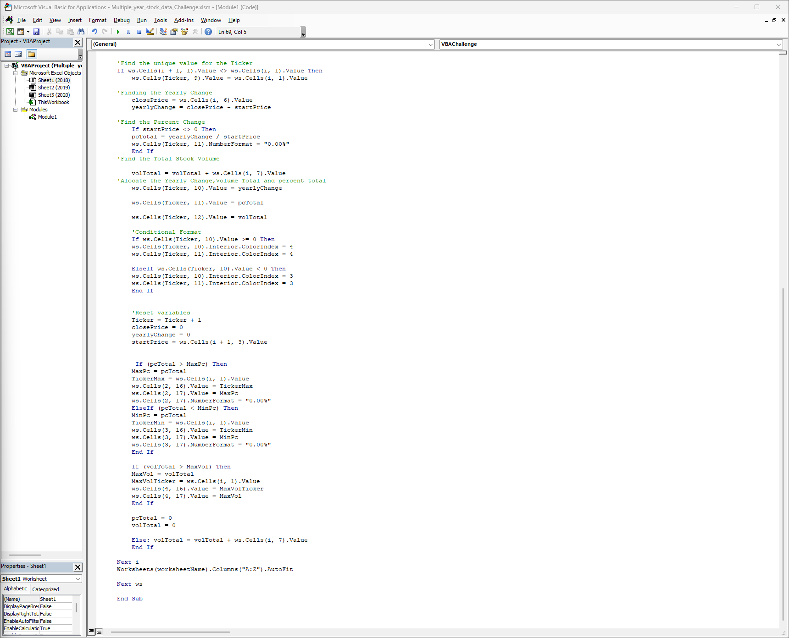
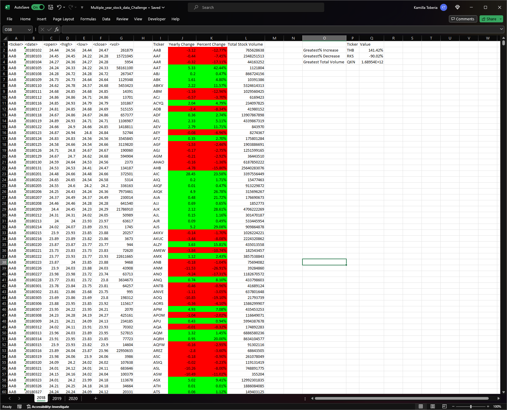
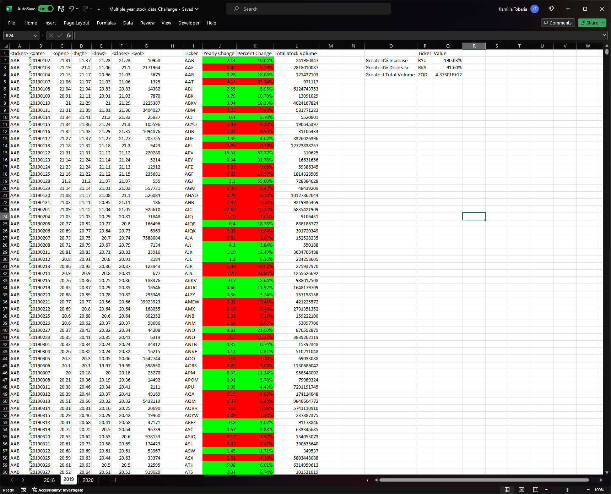

# VBA-challenge

## Purpose

This repository contains all the files related to the VBA-challenge.

## Solution Files

I have one files in the folder:

-VBA code

## Screenshots

All five screenshots are added.

### Code VBA

### Tables Screenshots

-Table 2018

-Table 2019

-Table 2020

## Steps

-Looping through all the sheets.

- Create the columns and name it.

- Loop

- Find the unique value for the Ticker

- Finding the Yearly Change

- Finding the Percent Change

- Find the Total Stock Volume

- Alocate the Yearly Chnage, Volume Total and Percent Total

- Conditional Format

- Reset Variables

- Finding the Max Percent, Min Percent and Max Volume
  Finding the names of the respective Tickers and Alocate them.

- Formating the sheet to fit the values.

